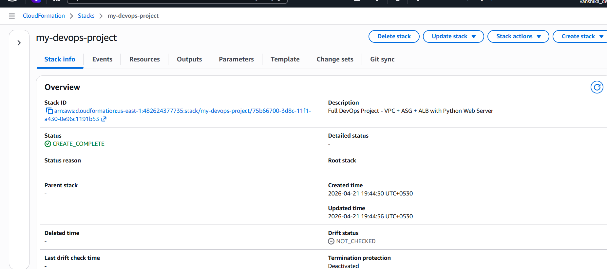
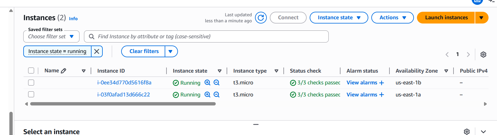
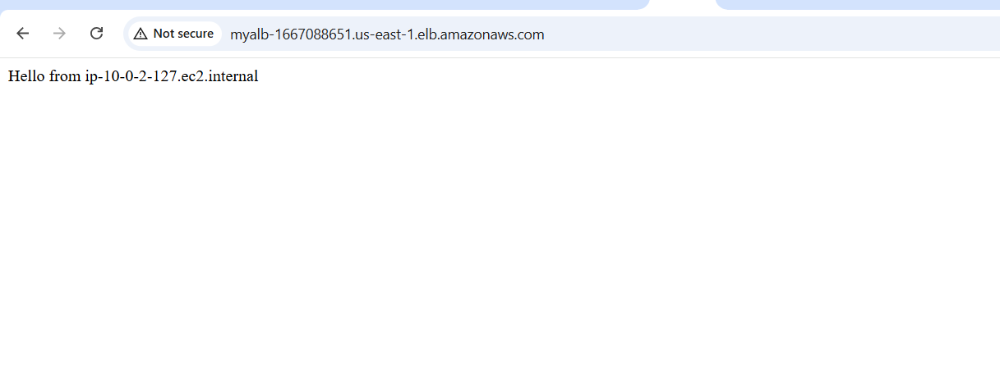
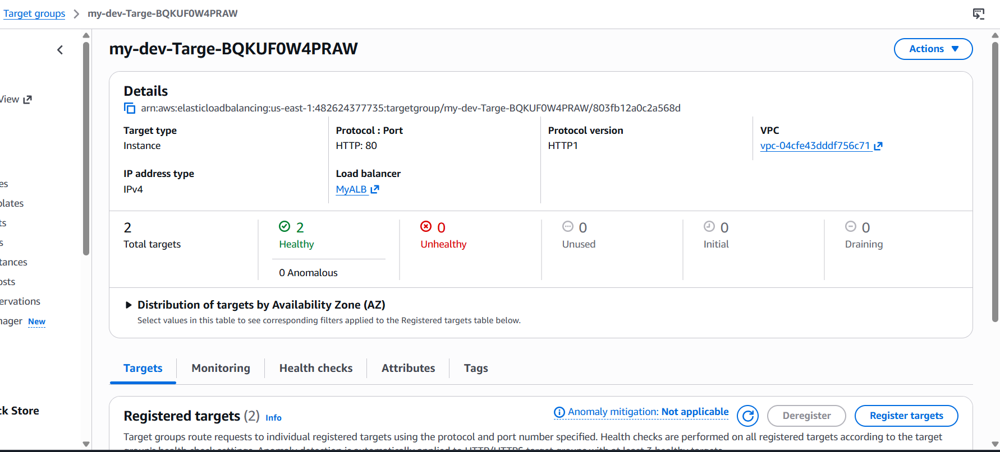
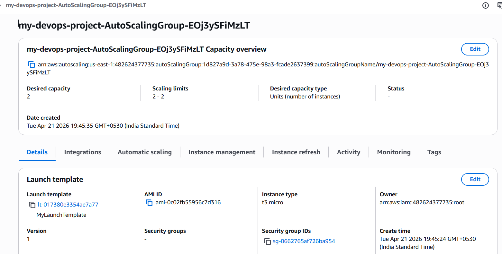

# 🚀 Full DevOps Project: AWS VPC + ASG + ALB with Python Web Server

## 📌 Overview

This project demonstrates how to build a **highly available and scalable infrastructure** on AWS using Infrastructure as Code (IaC) with CloudFormation.

A simple **Python web server** is deployed on EC2 instances, and traffic is distributed using an Application Load Balancer.

---

## 🛠️ Services Used

* AWS CloudFormation
* Amazon EC2
* Auto Scaling Group (ASG)
* Application Load Balancer (ALB)
* VPC (Subnets, Route Tables, Internet Gateway)

---

## 🏗️ Architecture

* Custom VPC created
* 2 Public Subnets across multiple Availability Zones
* Internet Gateway for public access
* Auto Scaling Group with EC2 instances
* Application Load Balancer distributing traffic
* Python HTTP server running on each instance

---

## 🐍 Python Web Server Setup

Each EC2 instance runs a simple Python-based web server using UserData:

```bash
#!/bin/bash
yum update -y
yum install -y python3
echo "Hello from $(hostname)" > index.html
nohup python3 -m http.server 80 &
```

### 🔍 What this does:

* Installs Python3
* Creates a simple HTML page
* Starts a web server on port 80
* Displays instance hostname

👉 This helps verify:

* Load balancing (different responses)
* Instance-level traffic handling

---

## 🚀 Deployment

### Using AWS CLI

```bash
aws cloudformation deploy \
  --template-file template.yaml \
  --stack-name my-devops-project \
  --capabilities CAPABILITY_NAMED_IAM
```

---

### Using AWS Console

1. Go to CloudFormation
2. Click **Create Stack**
3. Upload `template.yaml`
4. Deploy stack

---

## 🌐 Application Access

After deployment, go to **Outputs tab** and copy:

```
LoadBalancerDNS
```

Open in browser:

```
http://<LoadBalancerDNS>
http://http://myalb-1667088651.us-east-1.elb.amazonaws.com/
```


---

## 🔍 Verification Steps

* Confirm EC2 instances are running
* Check Auto Scaling Group capacity
* Verify Target Group health = Healthy
* Refresh browser to confirm load balancing

---

## 📸 Screenshots

### Stack Created



### EC2 Instances



### Load Balancer



### Target Group Health



### Auto-scaling Output



---

## ✅ Features

* High Availability (Multi-AZ)
* Auto Scaling (self-healing infrastructure)
* Load Balancing
* Infrastructure as Code (IaC)
* Lightweight Python Web Server

---

## 💡 Learning Outcomes

* CloudFormation hands-on
* AWS networking fundamentals
* Scaling & load balancing concepts
* Real-world DevOps architecture design

---

## ⚠️ Cleanup

To avoid charges:

```bash
aws cloudformation delete-stack --stack-name my-devops-project
```

---

## 👩‍💻 Author

Vanshika Jaiswal
